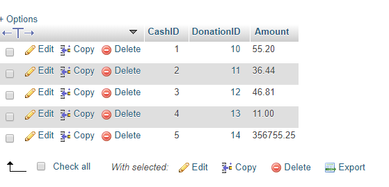
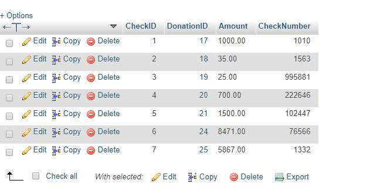
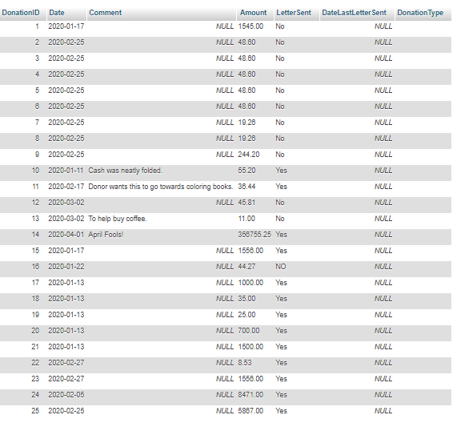
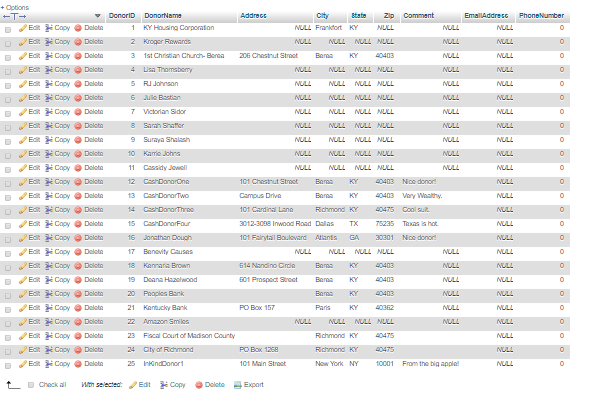
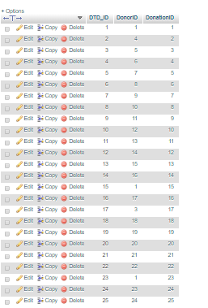
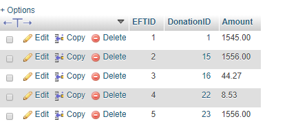
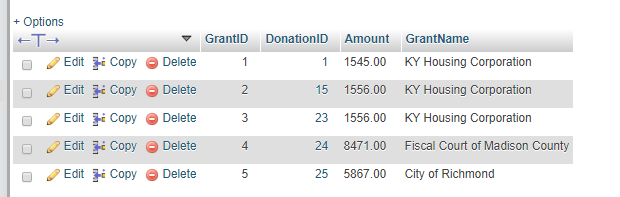
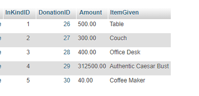
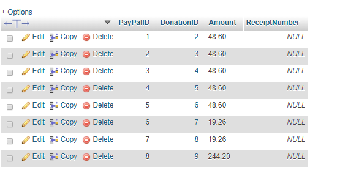

# PM05- Creating your Database Application

This is the final project milestone of the abbreviated Sp2020 CSC330 course.
## Objective:
The goal of this milestone is to develop a skeleton database application to hand off to your client.
This milestone will walk you through the steps to prepare the necessary queries to retrieve data from database and translate your SQL tables into Python classes.


## Preparation
- Your team should have sufficient sample data entered into your database to evaluate your queries.
- Your team should have an updated plan based on your contract renegotiation discussion with clients.
- If off campus, you should have setup VPN access to your virtual machine
- If you are unfamiliar with Linux terminal commands, particularly related to directories and understanding your current working directory, please review [this section](https://help.ubuntu.com/community/UsingTheTerminal#File_.26_Directory_Commands) on basic commands.

## Deliverables
By April 23, push to this repository:
1. SQL Queries
2. Screenshots of tables from your database structure (from myPhPAdmin)
3. A models.py file with your python classes and query methods
4. A link to your meeting document with notes from all team and client meetings since March

## Part 1 - Develop SQL Queries

Every piece of information displayed in your UI will likely come from your database, or be derived from data in your database.
Using your paper prototype as a guide, list out and write the SQL queries you will need to retrieve
the necessary data from your database to populate your webpage.

T04 and T05 were examples of how to start thinking about translating the information needed for your client into queries from the database.

_For example, if we were developing a dashboard for a Hubway client that showed the last known location of every bike,
the number of times a bike had been checked out, and how many bikes were at each station, then this dashboard would likely
require at least 3 SQL queries to supply this data to the dashboard page._

Copy and Paste your SQL queries here, with a comment containing a brief explanation of each query's purpose.
```

#This query shows the amount donated in a particular year by a donor with DonorID ___
	SELECT SUM(Donation.Amount) FROM donors INNER JOIN DonorsToDonations ON donors.DonorID INNER JOIN Donation ON
	Donation.DonationID WHERE Donation.Date >= '2020-01-01 00:00:00' and Date < '2021-01-01 00:00:00' and donors.DonorID=1
	
#This query shows the total amount of donation made by a donor with DonorID ___ since the beginning of time
	SELECT SUM(Donation.Amount) FROM donors INNER JOIN DonorsToDonations ON donors.DonorID INNER JOIN Donation ON
	Donation.DonationID WHERE  donors.DonorID=1;
	
#This query shows the number of donors for a particular year
	SELECT DISTINCT COUNT(donors.DonorID) FROM donors INNER JOIN DonorsToDonations ON donors.DonorID INNER JOIN Donation ON
	Donation.DonationID WHERE Donation.Date >= '2020-01-01 00:00:00' and Date < '2021-01-01 00:00:00'
	
#This query list all donations and its information (Date, comment, amount, type, donor) for all time (from the beginning of time)
	SELECT * FROM `Donation` INNER JOIN DonorsToDonations WHERE DonorsToDonations.DonationID= Donation.DonationID;
	
#This query list all donations and its information (Date, comment, amount, type, donor) for a particular year
	SELECT * FROM `Donation` INNER JOIN DonorsToDonations WHERE DonorsToDonations.DonationID= Donation.DonationID AND Donation.Date >= '2020-01-01 00:00:00' and Date < '2021-01-01 00:00:00'
	
#This query shows whether thank you letter is sent for a donation
    --suppose donation id is 1
    	SELECT Donation.LetterSent FROM Donation WHERE DonationID =1
 
#This query shows the total amount donated since the beginning of time (excluding grants)
	SELECT SUM(Amount) FROM `Donation`

#This query shows the total amount donated for a particular year (ex: 2019) (excluding grant) 
	SELECT SUM(Amount) FROM `Donation` WHERE Date >= '2020-01-01 00:00:00' and Date < '2021-01-01 00:00:00'

#This query shows the total amount of grant received since the beginning of time
     	SELECT SUM(Amount) FROM `Grant`;

#This query shows the total amount of grant received for one year
	SELECT * FROM `Donation` WHERE Date >= '2020-01-01 00:00:00' and Date < '2021-01-01 00:00:00' and DonationType='Grant'

#This query list all donors and their information (DonorName, Address, City, State, Zip, Comment, Email, Phone) for all time (from the beginning of time)
   	SELECT DonorName,Address,City,State,Zip,Comment,EmailAddress,PhoneNumber FROM donors

#This query list all donors and their information (DonorName, Address, City, State, Zip, Comment, Email, Phone) for this current year only
	SELECT DISTINCT
	donors.DonorName,donors.Address,donors.City,donors.State,donors.Zip,donors.Comment,donors.EmailAddress,donors.PhoneNumber FROM
	donors INNER JOIN DonorsToDonations AS dtd ON dtd.DonorID INNER JOIN Donation ON Donation.DonationID WHERE Donation.Date >=
	'2020-01-01 00:00:00' and Donation.Date < '2021-01-01 00:00:00'

#This query shows the number of donors for all time (from the beginning of time)
   	SELECT COUNT(*) FROM donors
	
#This query update data for a donor – DonorName, Address, City, State, Zip, Comment, Email, Phone)
  	--suppose donorID is 1 and we want to update everything to NULL except for the name and update email address address to 		hello@gmail.com
  	SELECT DonorName, Address, City,State,Zip,Comment,EmailAddress, PhoneNumber FROM donors WHERE DonorID = 1;UPDATE donors SET EmailAddress = `hello@gmail.com` WHERE DonorID = 1;
  	SELECT DonorName, Address, City,State,Zip,Comment,EmailAddress, PhoneNumber FROM donors WHERE DonorID = 1;UPDATE donors SET Phone = NULL WHERE DonorID = 1;
  	SELECT DonorName, Address, City,State,Zip,Comment,EmailAddress, PhoneNumber FROM donors WHERE DonorID = 1;UPDATE donors SET Address = NULL WHERE DonorID = 1;
  	SELECT DonorName, Address, City,State,Zip,Comment,EmailAddress, PhoneNumber FROM donors WHERE DonorID = 1;UPDATE donors SET City = NULL WHERE DonorID = 1;
  	SELECT DonorName, Address, City,State,Zip,Comment,EmailAddress, PhoneNumber FROM donors WHERE DonorID = 1;UPDATE donors SET State = NULL WHERE DonorID = 1;
  	SELECT DonorName, Address, City,State,Zip,Comment,EmailAddress, PhoneNumber FROM donors WHERE DonorID = 1;UPDATE donors SET Zip = NULL WHERE DonorID = 1;
  	SELECT DonorName, Address, City,State,Zip,Comment,EmailAddress, PhoneNumber FROM donors WHERE DonorID = 1;UPDATE donors SET Comment = NULL WHERE DonorID = 1; 

#This query delete a donor
  	DELETE FROM donors WHERE DonorID =1;

#This query shows the date of the last thank you letter sent for a particular donor
	--suppose donorID is 1
	SELECT DonorID, Donation.LetterSent, MAX(Donation.Date) AS date_last_donation FROM Donation INNER JOIN DonorsToDonations AS dtd
	ON dtd.DonorID WHERE DonorID =1 AND Donation.LetterSent = 'yes' GROUP BY Donation.LetterSent
	
#This query shows all the donation made by the donor which thank you letter had not been sent to, as well as the date, amount, and type of each of those donations
	SELECT * ,Date,Amount,DonationType FROM `Donation` WHERE LetterSent = "NO";

#This query shows the donor name, address, city, state, zip, email, and phone for a donor whose DonorID is _____ 
	--supposed donor id is 1
	SELECT DonorName, Address, City, State, Zip, EmailAddress, PhoneNumber FROM donors WHERE DonorID =1

#This query shows the date, amount, and type of the donation, for the donations selected by the user to send thank you letter to, and the sum of all the donations selected
	--suppose the donations selected by the user to send thank you letter to has donationID of 1
	SELECT Date,Amount,DonationType, SUM(Amount) FROM `Donation` WHERE DonationID=1	
	
#This query list all grants and its information (Date, grant name, amount, comment) for a particular year
	SELECT `Grant`.GrantName, `Grant`.Amount, Donation.Date, Donation.LetterSent, Donation.DateLastLetterSent, Donation.Comment
	FROM `Grant` INNER JOIN Donation ON Donation.DonationID WHERE Donation.Date >= '2020-01-01 00:00:00' and Date < '2021-01-01
	00:00:00'
	
#This query list all grants and its information (Date, grant name, amount, funding source?, comment) for all time
	SELECT `Grant`.GrantName, `Grant`.Amount, Donation.Date, Donation.LetterSent, Donation.DateLastLetterSent, Donation.Comment
	FROM `Grant` INNER JOIN Donation ON Donation.DonationID

#This query update data for a grant – grant name, amount)
	--suppose grantID is 1 and we want to update grant name to "grant1" and amount to $800
	SELECT GrantName, Amount FROM `Grant` WHERE GrantID = 1;
	UPDATE `Grant` SET GrantName = `grant1` WHERE GrantID = 1;
	UPDATE `Grant` SET Amount = `800`;
	
#This query inserts a new grant – grant name, amount)
	--suppose amount is $900 and grant name is thegrant
	INSERT INTO `Grant`(Amount,GrantName) VALUES (`900`,`thegrant`);
	
#This query list all donations and its information (Date, comment, amount, type) made by a particular donor with DonorID ___
	SELECT DISTINCT Donation.Date,Donation.Comment,Donation.Amount,Donation.DonationType FROM donors INNER JOIN DonorsToDonations
	ON donors.DonorID INNER JOIN Donation ON Donation.DonationID WHERE donors.DonorID=1

#This query shows the 5 top donors for all time (from the beginning of time)
	SELECT MAX FROM (SELECT SUM Donation.Amount FROM (SELECT `Donation` INNER JOIN DonorsToDonations INNER JOIN donors WHERE
	DonorsToDonations.DonationID=DonorsToDonations.DonationID) AS TABLE2) AS TABLE1 LIMIT 5;
	
#This query shows the 5 top donors for this year only
	SELECT MAX FROM (SELECT SUM Donation.Amount FROM (SELECT `Donation` INNER JOIN DonorsToDonations INNER JOIN donors WHERE
	DonorsToDonations.DonationID=DonorsToDonations.DonationID) AS TABLE2) AS TABLE1 LIMIT 5 
	WHERE Donation.Date >= '2020-01-01 00:00:00' and Date < '2021-01-01 00:00:00';

#This query update data for a donation – Address, City, State, Zip, Comment, Email, Phone, type, amount, comments)
	SELECT `DonationID`,`Amount` FROM Donation WHERE DonationID = 1; UPDATE Donation SET Amount =`20` WHERE DonationID` = 1;
	SELECT `DonorID`,`DonorName` FROM donors WHERE DonorID = 1; UPDATE donors SET DonorName =`Jon Doe` WHERE 				`DonorID`= 1;

#This query inserts a new donation (Data: Date, DonorName, Address, City, State, Zip, Comment, Email, Phone, type, amount, comments) – if the donor doesn’t exist, make a new donor; otherwise, if donor already exists, simply add a donation to the donor.
	INSERT INTO Donation (`Date`,`Comment`,`Amount``,`DonationType`) VALUES ('2021-01-01' `donor wants donation to be spend on
	books`,'500','EFT`);
	INSERT INTO donors (`DonorName`,`Comment`,`Address``,`City`,`State`,`Zip`,`EmailAddress`,`PhoneNumber`) VALUES ( `Jon
	Doe`,`donor wants donation to be spend on books`,'101 chestnute st.','Berea`, `KY`,`40404`,`hello@gmail.com`,`87928271`);
	INSERT INTO Donation (`DonorID`,`DonationID`) VALUES (donor id,donationID);
	-if already exist:
	SELECT `DonorID`,`EmailAddress` FROM donors WHERE DonorID = 1; UPDATE donors SET EmailAddress =`hello@gmail.com` WHERE
	`DonorID`= 1;
	SELECT `DonationID`,`Amount` FROM Donation WHERE DonationID = 1; UPDATE Donation SET Amount =`20` WHERE DonationID` = 1;
...
```

## Part 2 - Setup a basic Flask application
:exclamation: **TODO:** Follow each step to setup your Linux virtual environment.

### Step 1. Connect your Linux VM using the Terminal/Console
- Login to the VPN (You must be connected to Berea's VPN to access your virtual machine)
- Login to your virtual machine using Mac Terminal or [MobaXterm](https://mobaxterm.mobatek.net/download.html):

```
ssh USERNAME@IPADDRESS
```

- Clone the Github repository to your home directory:

``` git clone URL_TO_YOUR_REPO ```

- Go into your cloned repository directory:

```
ls -al
(this shows all files and folders in the current directory. Find your pm-05 directory)
cd YOUR_PM-05_DIRECTORY
 ```

### Step 2. Create a virtual environment and install dependencies
- Copy the setup.sh file into the ```www``` directory in your home directory (i.e., /home/USERNAME/www)

``` >>> cp setup.sh /home/USERNAME/www ```

- Copy the requirements.txt file into the ```www``` directory in your home directory (i.e., /home/USERNAME/www)

``` >>> cp requirements.txt /home/USERNAME/www ```

- Run the setup file from the www directory. This will create a python virtual environment (/home/USERNAME/www/venv/) as well as install the dependencies that you need on your machine. This command will only work if your current working directory is the same as the setup.sh file (i.e., /home/USERNAME/www)

```
>>> cd /home/USERNAME/www
>>> source setup.sh
```

- Navigate to the venv directory and activate the virtual environment:

```
>>> cd /home/USERNAME/www/venv
>>> . bin/activate
```

(When the virtual environment is activated, you will see its name at the start of your command prompt, looking something like this.)

```
(venv) user@172.1.2.3:pm05 user$

```

## Part 3 - Create Python Classes for your Database Model

An object-relational model (ORM) turns your data model into a class model that you're familiar with from object-oriented programming. This way, you can treat your database entities like classes, and each entry into your database like an instance of the class. In this class, we use the Peewee Python library, which is compatible with several different databases, including MySQL.

The [sampleModels.py](sampleModels.py) file is an example of a python ORM of a database, as used by the Student Software Development Team.

Insert or link to screenshots of your database table structure from phpMyAdmin

Image of Cash Table
   

Image of Check Table
   

Image of Donation Table
   

Image of Donors Table
   

Image of Donors to Donation Table
   

Image of EFT Table
   

Image of Grant Table
 

Image of InKind Donation Table
 

Image of Paypal Donation Table
 


### Step 1. Create Models.py file
The [Peewee documentation](http://docs.peewee-orm.com/en/latest/peewee/models.html) includes detailed HOWTO's, examples, and explanations.

:exclamation: **TODO**:
We've provided a starter [models.py](models.py) that you can use. To complete the steps below, simply copy the file, or its contents, into your /home/USERNAME/www directory and modify as needed.

In the examples and [_models.py_](models.py):
 -  Notice how the class name is the same as the table name, and the class attributes are the same as the columns
 -  Peewee has equivalent datatypes for MySQL (See the documentation for full list)

#### There are two ways to create an ORM from your model:

_Semi-automated class creation:_

For pre-existing databases, Peewee provides a command line tool to automatically create an ORM that mirrors your database. This can save you a lot of typing! However, it will not be perfect, so you can use this to speed up your process, but not as your final product! Continue on to the manual step to check your columns, datatypes, fields, keys, and constraints.

:exclamation: **TODO:** In your FLASKDIR, replace the ALL CAPS fields and run this script on your command line. It will create or modify a models.py file:

```>>> python -m pwiz -e mysql -u root -H localhost -P DATABASENAME > models.py```

_Manual class creation:_

In your models.py file, create a class for each table in your database. See the model.py sample file for an example.
- Each class definition includes the table name, each column in the table, the field datatype, and primary and foreign keys
- Just like regular python classes, you can also include functions inside your class to perform object-specific functions (such as validity checks)

_Notes_: The below class function defines what information is returned when you call an instance of the object. If you leave this out, the default printout is the memory location, so it's worth it to put some useful identifying info here. That may be the ID (as below), or it could be other useful information (e.g., First Name and Last name).
```
def __str__(self):
                return str(self.ID)
```

### Step 2: Connect to your Database

Once your model is setup, you can connect to your database and start making queries!

Connecting to your database is 1 line of code ```database.connect()``` Every time you want to execute a set of queries, connect to the database, and disconnect when you are done, using ```database.close()```

You can test out your connection by making a few [test SELECT statements](http://docs.peewee-orm.com/en/latest/peewee/querying.html#selecting-multiple-records).

For example, in the example below, we open a connection, execute a simple SELECT query, print the first row from the result, and close the connection.

```
mainDB.connect()
query = Stations.select() #Replace "Stations" with the name of your class
print(query[0])
mainDB.close()
```

Another example is included in models.py which prints every row from the resulting SELECT query.

To see your query results, execute the python file.

``` >>> python models.py ```

If you have a lot of results, you might want to redirect them into another file. [View results in table format](https://www.tecmint.com/display-command-output-or-file-contents-in-column-format/)

```>>> python models.py > results.csv```

### Step 3: Write out your queries

Peewee provides a couple ways to write out your SQL queries.

__Option 1__:* The preferred method is generally to use [built-in methods to Create, Update, Retrieve (select), and Delete rows:](docs.peewee-orm.com/en/latest/peewee/querying.html)

For example, in Step 2, the ```.select()``` method represents the SELECT statement.

Peewee supports all the SQL clauses, such as [WHERE](http://docs.peewee-orm.com/en/latest/peewee/querying.html#filtering-records), [GROUP_BY](http://docs.peewee-orm.com/en/latest/peewee/querying.html#aggregating-records), and [JOINS](http://docs.peewee-orm.com/en/latest/peewee/relationships.html). It might even be easier to write your queries out this way!

__Option 2__: You can also [execute a SQL query directly](http://docs.peewee-orm.com/en/latest/peewee/database.html#executing-queries):

:exclamation: **TODO:** Write out your queries in Python. Place these queries in appropriately named functions at the bottom of your _models.py_ file. (i.e.:

```
def getNewDonors():
  return Donors.select(id, name).where(joinDate < '2020-01-01')
```

or more appropriately:

```
def getNewDonors(join_date):
  return Donors.select(id, name).where(joinDate < join_date)
```

Be sure to test all your queries!

---

## Submission Instructions
This is the final milestone of the course! All teamworks, milestones, and associated files should be submitted by April 23 @ 11:55PM.
1. Export and add your .sql file for your project to this repository.
2. Commit and push your README and Python files, and any supporting materials (i.e. images).
3. Merge any branches you created to the master branch.
